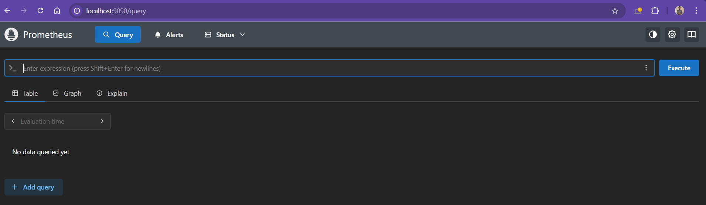

# Expression Browser
The Expression Browser is a built-in web UI provided by Prometheus that allows to execute ad hoc PromQL queries, and generate simple graphs.

It has a limited/basic functionality and has no ability to build custom dashboards and not ideal for day-to-day monitoring.

## Accessing the Expression Browser
Open the browser and navigate to the IP address of Prometheus server along with the appropiate port numner.

