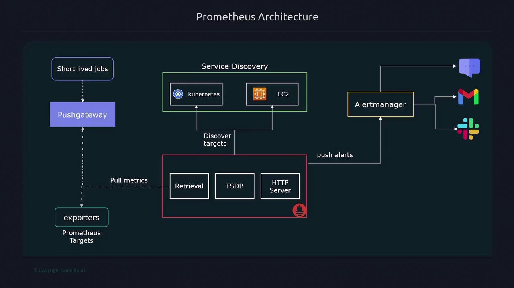

# Core Components of Prometheus Server
- Data Retrieval Worker
- Time Series Database
- HTTP Server

## Data Retrieval Worker
- The data retrieval worker is reponsible for gathering or scarping the metrics from targets.
- It does this by sending HTTP requests - typically to the <code>/metrics</code> endpoints of your applications or systems.
- once collected, these metrics are stored in time series database for analysis.

## Time Series Database
- The time series database serves as a dedicated repository for the collected metrics.
- Optimized specifically for time series data, it enables efficient recording and rapid retrieval of metrics information.

## HTTP Server
- The HTTP server provides a query interface that allows users to access, visualize and analyze stored metrics.
- By leveraging PromQL (Prometheus's built-in query language) - users can interact with the data via either the Prometheus web UI or third-party visualization tools such as Grafana.

> [!NOTE]
> Additional components such as exporters, service discovery, and Alertmanager extend Prometheus’s functionality in dynamic environments.

---

# Exporters, PushGateway and Targets
## Exporters
- To scrape metrics effectively, Prometheus use exporters.
- **Exporters are lightweight processes running on the targets that expose metrics in a Prometheus-compatible format.**
- Since many systems do not natively present metrics as expected by Prometheus, exporters are essential for converting internal data into a standardized format.

## PushGateway
- **Prometheus uses a pull-based model**, meaning it actively queries targets.
- However, for short-lived jobs that might not exist long enough to be scraped, the Pushgateway is used.
- **Pushgateway temporarily stores metrics pushed by the jobs until Prometheus can scraps them.**

# Alerting
- Prometheus supports alreting by evaluating collected metrics against defined thresholds.
- While it does not send notifications directly, it forwards alerts to Alertmanager.
- Alertmanager then manages and dispatches notifications through various channels like Email, SMS, Slack, etc.

---

# Querying Metrics with PromQL
## Collecting Metrics
- PRometheus enables users to query and visualize metrics using PromQL.
- PromQL enables the users to interact with the data via either the Prometheus web UI or third-party visualization tools such as Grafana.
- By default, Prometheus scrapes metrics from the <code>/metrics</code> endpoint of each target, though this endpoint can be customized in the configuration if needed.

## Exporters
- Many systems do not expose metrics in the required format; exporters bridge this gap by collecting metrics from applications, converting them into a compatible format, and exposing them on the <code>/metrics</code> endpoint for Prometheus to scrape.

- Prometheus offers a range of native exporters: 
    - Node Exporter for Linux systems
    - Windows
    - MySQL
    - Apache
    - HAProxy

# Custom Metrics Collection
## Client Libraries
- For applications that require monitoring of custom metrics such as tracking errors, latency, or execution time - Prometheus provides client libraries in multiple programming languages, including Go, Java, Python, Ruby, and Rust.
- These libraries enable you to expose application specific metric tailored to your needs.

---

# Pull-Based vs Push-Based Collection Models
- Prometheus is primarily built around a pull-based model, meaning it scrapes metrics from known targets.
- This model offers several advantages:
    - Easier detection of targets that are down.
    - Control over server load, as metrics are collected at scheduled intervals.
    - Maintenance of an up-to-date list of targets, ensuring a reliable source of truth.
- In contrast, push-based models used by systems like Logstash, Graphite and OpenTSDB rely on targets sending metrics directly to the server without the need for prior registration.

## Advantages of Pull-Based Model
- Easier to tell if a target is down.
- Reduced risk of server overload by controlling the rate of metric collection.
- Have a definite list of targets to monitor, creating a central source of truth.

- Although the pull-based model is effective for numeric metrics, it may not be ideal for event-based data or short-lived jobs.
- In such cases, the Pushgateway allows these jobs to push their metrics for subsequent scraping by Prometheus.

## Advantages of Push-Based Model
- Event-based systems, when pulling data wouldn’t be a viable option
- Short lived jobs, as they may end before a pull can occur

---

> [!NOTE]
> - Prometheus is engineered for the efficient collection, storage, and querying of time series metrics. 
> - Its modular architecture—including key components like exporters, service discovery, and Alertmanager—ensures it can meet the monitoring requirements of both static and dynamic environments. 
> - By leveraging a pull-based model and providing push-based alternatives via Pushgateway, Prometheus offers a comprehensive monitoring solution for a wide variety of use cases.
