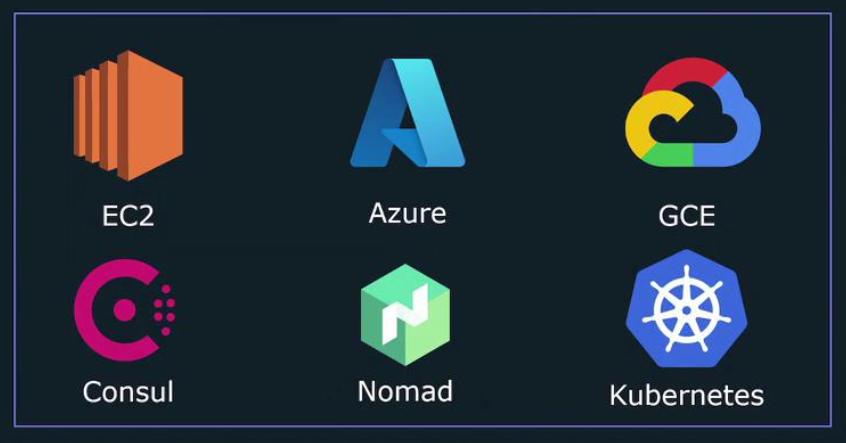

# Introduction - Service Discovery
- Service Discovery allows Prometheus to populate a list of endpoints to scrape that can get dynamically updated as new endpoints (targets) get created and destroyed.
- Instead of manually listing every single endpoint Prometheus needs to scrape for metrics in its configuration file, service discovery acts as a dynamic source of targets that Prometheus can query at runtime.
- Prometheus supports several built-in service discovery mechanisms to accommodate various environments.



- The static configuration method is also technically a basic form of service discovery, as it explicitly defines which HTTP endpoints Prometheus should monitor.

```yml
scrape_configs:
  - job_name: "web"
    static_configs:
      - targets: ["localhost:9090"]
  - job_name: "node"
    static_configs:
      - targets: ["192.168.1.168:9100"]
  - job_name: "docker"
    static_configs:
      - targets: ["localhost:9323"]
```