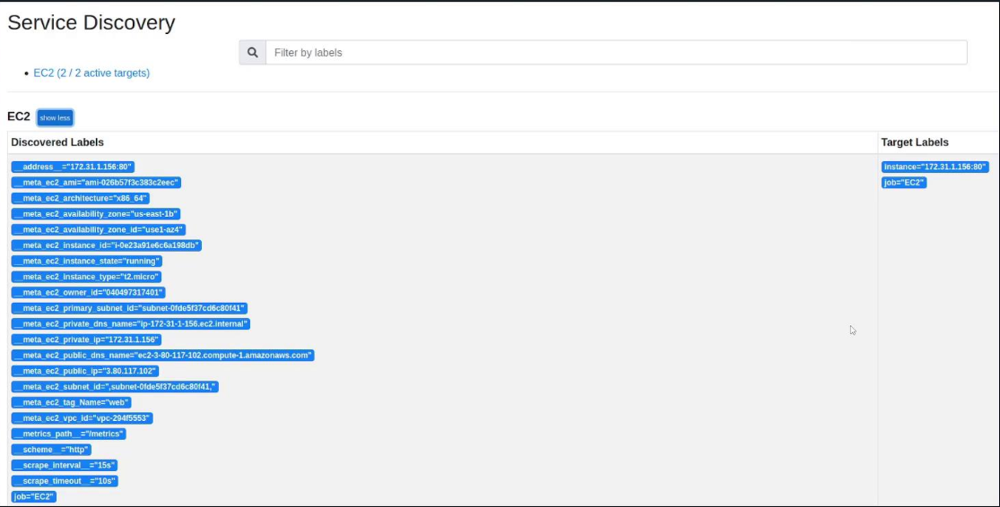

# AWS
- we can configure EC2 service discovery by setting up the `ec2_sd_configs` block within Prometheus. 
- This setup requires three pieces of information:
    - AWS region
    - Access key
    - Secret key
- These credentials must belong to an **IAM user** with `AmazonEC2ReadOnlyAccess` access.
- Example:

```yml
scrape_configs:
  - job_name: EC2
    ec2_sd_configs:
      - region: <region>
        access_key: <access key>
        secret_key: <secret key>
```

- Once configured, Prometheus begins collecting extensive metadata from the EC2 instances.
- We can view many discovered labels — such as tags, instance types, VPC IDs, and private IPs.
- By default, Prometheus uses the **Private IP** as the instance label because it is typically deployed close to its targets within the same cloud environment and also not all instances have Public IP address. 



---

# Configuring AWS Access for Prometheus
## Create IAM User
- To enable Prometheus to access AWS EC2 metadata, we need to create an IAM user. 
- Follow below steps in the AWS Management Console:
    - Navigate to the IAM section.
    - Create a new user named `prometheus` (or whatever suits better). (This user is exclusively used for programmatic access and will not use the AWS Console.)
    - Enable programmatic access by generating an access key.
    - Attach the `AmazonEC2ReadOnlyAccess` policy to the user.
    - Create the user.
    - Copy the Access key and Secret key.

## Update Prometheus Configuration
- Edit Prometheus configuration file, typically located at `/etc/prometheus/prometheus.yaml`, to add a new job definition for EC2 service discovery. 
- Below is an example configuration integrating the EC2 SD setup with other scrape configurations:

```yml
# Global configurations
global:
  scrape_interval: 15s  # Scrape every 15 seconds (default is 1 minute).
  evaluation_interval: 15s  # Evaluate rules every 15 seconds (default is 1 minute).

# Alertmanager configuration
alerting:
  alertmanagers:
    - static_configs:
        - targets:
            - alertmanager:9093

# Rule files configuration (load rules periodically)
rule_files:
  # - "first_rules.yml"
  # - "second_rules.yml"

# Scrape configurations
scrape_configs:
  # Scrape configuration for Prometheus itself
  - job_name: "prometheus"
    static_configs:
      - targets: ['localhost:9090']

  # Scrape configuration for Node Exporter
  - job_name: "node"
    static_configs:
      - targets: ['192.168.1.168:9100']

  # Scrape configuration for EC2 instances
  - job_name: "ec2"
    ec2_sd_configs:
      - region: "us-east-1"  # Replace with your desired region
        access_key: "<access key>"  # Replace with your actual access key
        secret_key: "<secret key>"  # Replace with your actual secret key
```

- After saving the configuration file, restart Prometheus to apply these changes:
```bash
sudo systemctl restart prometheus
```

- Once Prometheus restarts, navigate to the `Status > Service Discovery` section within the Prometheus interface. 
- We should see discovered targets under the EC2 job, along with associated labels such as the AMI, architecture, owner ID, instance type, and private IP.
