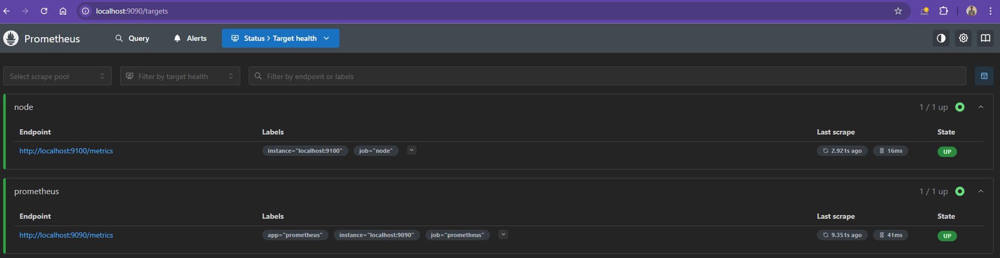
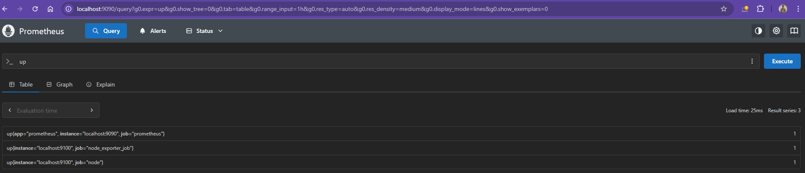

# Prometheus Configuration
- After installing Prometheus and setting up your nodes with Node Exporters to expose metrics, you must explicitly configure Prometheus to discover and scrape these targets using its pull-based model.
- The configuration is maintained in the `prometheus.yml` file, typically found inside `/etc/prometheus` directory.
- Below is a basic Prometheus configuration example:

```yaml
# my global config
global:
  scrape_configs:
    - job_name: "prometheus"
      static_configs:
        - targets: ["localhost:9090"]
```

- In this configuration:
    - The **global** section defines default parameters, which can be inherited or overridden by other sections.
    - The **scrape_configs** section specifies the target endpoints for scraping metrics.

---

# Detailed Scrape Configuration
- Prometheus used **scrape_configs** block to identify targets for metric collection. 
- In below enhanced example, additional parameters such as **scrape_interval**, **scrape_timeout**, and **sample_limit** allows to fine-tune the scraper's behavior.

```yaml
global:
  scrape_interval: 1m
  scrape_timeout: 10s

scrape_configs:
  - job_name: 'node'
    scrape_interval: 15s
    scrape_timeout: 5s
    sample_limit: 1000
    static_configs:
      - targets: ['localhost:9090']

# Configuration related to AlertManager
alerting:

# Rule files specifying where rules are read from
rule_files:

# Remote read/write settings
remote_read:
remote_write:

# Storage-related settings
storage:
```

- Key points in this configuration:
    - Global defaults specify a 1-minute scrape interval and a 10-second timeout.
    - The **node** job overrides these defaults, setting a 15-second interval and a 5-second timeout.
    - The **static_configs** block indicates the target IP and port for scraping metrics.
- Additional configuration blocks like **alreting, rule files, remote_read, remote_write,** and **storage** are available for extended use cases.

---

# Customizing Job Configurations
- When adding a new job under scrape_configs, you can specify details such as the **job name, scrape interval, timeout, scheme (HTTP/HTTPS),** and the **metrics path**. 
- By default, Prometheus scrapes metrics from the `/metrics` endpoint; however, customization is possible if your target uses a different endpoint.
- For instance, the following configuration demonstrates how to scrape two targets over HTTPS using a custom metrics path:

```yaml
scrape_configs:
  - job_name: 'nodes'
    scrape_interval: 30s
    scrape_timeout: 3s
    scheme: https
    metrics_path: /stats/metrics
    static_configs:
      - targets: ['10.231.1.2:9090', '192.168.43.9:9090']
```

- This configuration shows:
    - A job called **nodes** that scrapes every 30 seconds.
    - A 3-second scrape timeout.
    - Usage of HTTPS for securing the connection.
    - Changing the default metrics path from `/metrics` to `/stats/metrics`.
    - Two specified target nodes with their respective IP addresses and ports.

- The section below summarizes common adjustable options in the scrape_configs:
```yaml
scrape_configs:
  # Frequency to scrape targets from this job.
  [ scrape_interval: <duration> | default = <global_config.scrape_interval> ]
  
  # Per-scrape timeout for this job.
  [ scrape_timeout: <duration> | default = <global_config.scrape_timeout> ]
  
  # HTTP resource path for fetching metrics.
  [ metrics_path: <path> | default = /metrics ]
  
  # Protocol scheme used for requests.
  [ scheme: <scheme> | default = http ]
  
  # Sets the 'Authorization' header for each scrape request.
  # Note: 'password' and 'password_file' are mutually exclusive.
  basic_auth:
    [ username: <string> ]
    [ password: <secret> ]
    [ password_file: <string> ]
```

---

# Updating the Prometheus Configuration
- After modifying the `prometheus.yaml` file, Prometheus does not automatically reload changes, you must restart the Prometheus process. 
- If running Prometheus manually (e.g., using `./prometheus`), you can simply press Ctrl+C and restart the process. 
- For Prometheus running under systemd, use one of the following methods:
```bash
ctrl+c  -> ./prometheus
kill -HUP <pid>
```
- Or restart via systemd with:
```bash
sudo systemctl restart prometheus
```

- Consider an updated `prometheus.yaml` configuration that adds a new job for scraping a Node Exporter on a specific Linux machine:
```yaml
# my global config
global:
  scrape_interval: 15s # Scrape every 15 seconds (default is 1 minute).
  evaluation_interval: 15s # Evaluate rules every 15 seconds (default is 1 minute).
  # scramble_timeout uses the global default (10s).

# Alertmanager configuration
alerting:
  alertmanagers:
    - static_configs:
        - targets:
          - alertmanager:9093

# Load rules periodically based on the global evaluation interval.
rule_files:
  # - "first_rules.yml"
  # - "second_rules.yml"

# Scrape configuration:
# Prometheus scrapes itself via the "prometheus" job.
scrape_configs:
  - job_name: "prometheus"
    # metrics_path defaults to `/metrics`
    # scheme defaults to `http`.
    static_configs:
      - targets: ["localhost:9090"]

  - job_name: "node"
    static_configs:
      - targets: ["192.168.1.168:9100"]
```

- In this updated configuration:
    - The **prometheus** job continues to scrape Prometheus itself.
    - A new **node** job is added to scrape a Linux machine running Node Exporter on IP `192.168.1.168` at port `9100`.

- After updating the configuration, restart the Prometheus service to apply the changes:
```bash
sudo systemctl restart prometheus
```

---

# Verifying the Configuration
- After restarting Prometheus, open the Prometheus web UI and navigate to the `Status > Target health` page. 
- Here you can inspect all configured targets and their scrape status. 
- Both the Prometheus target and the new node target should display an "UP" status for successful metric collection.



- You can further verify the configuration by executing queries such as:
```ini
up{instance="192.168.1.100",job="node"}
up{instance="localhost:9090",job="prometheus"}
```



- A returned value of 1 confirms that the instances are active and functional.