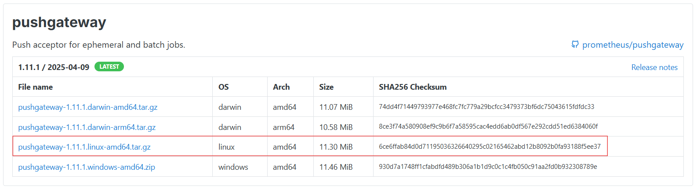

# Introduction - Pushgateway
- **Prometheus uses a pull-based model**, meaning it actively queries targets.
- However, for short-lived jobs that might not exist long enough to be scraped, the Pushgateway is used.
- **Pushgateway temporarily stores metrics pushed by the jobs until Prometheus can scraps them.**

---

# Installation - Pushgateway
## Step 1: Download and Extract the Binary
1. Go to official Prometheus [downloads page](https://prometheus.io/download/). Copy URL of the [pushgateway](https://prometheus.io/download/#pushgateway) for Linux "tar" file.



2. Run the following command to download package. Paste the copied URL after wget in the below command:
```bash
wget https://github.com/prometheus/pushgateway/releases/download/v1.11.1/pushgateway-1.11.1.linux-amd64.tar.gz
```

3. Now go to Pushgateway downloaded location and extract it using `tar` command.
```bash
tar -xvf pushgateway-1.11.1.linux-amd64.tar.gz
```

4. Rename it as per your preference (optional).
```bash
mv pushgateway-1.11.1.linux-amd64.tar.gz pushgateway
```

---

## Step 2: Configure Systemd for Push Gateway
1. Create a user for the pushgateway.
```bash
useradd --no-create-home --shell /bin/false pushgateway
```
- As we do not need `pushgateway` user to login and have home directory.

2. Copy `pushgateway` binary from the `pushgateway` folder to `/usr/local/bin`.
```bash
cp  pushgateway/pushgateway /usr/local/bin
```

3. Change the ownership to `pushgateway` user.
```bash
chown pushgateway:pushgateway usr/local/bin/pushgateway
```

---

## Step 3: Configure Pushgateway Service Unit file
1. Create the Pushgateway Service File.
```bash
vi /etc/systemd/system/pushgateway.service
```

2. Add the following content to the file.
```bash
[Unit]
Description=Prometheus Pushgateway
Wants=network-online.target
After=network-online.target

[Service]
User=pushgateway
Group=pushgateway
Type=simple
ExecStart=/usr/local/bin/pushgateway

[Install]
WantedBy=multi-user.target
```

3. Reload the systemd service.
```bash
systemctl daemon-reload
```

4. Start the pushgateway service.
```bash
systemctl start pushgateway
```

5. Check the pushgateway service status (optional)
```bash
systemctl status pushgateway
```

6. Enable the pushgateway service so that it can get automatically started after boot
```bash
systemctl enable pushgateway
```

7. A typical status output might look like:
```bash
● pushgateway.service - Prometheus Pushgateway
   Loaded: loaded (/etc/systemd/system/pushgateway.service; enabled; vendor preset: enabled)
   Active: active (running) since Fri 2022-10-14 00:19:52 EDT; 5s ago
     Main PID: 536942 (pushgateway)
      Tasks: 5 (limit: 8247)
     Memory: 3.8M
        CPU: 7ms
     CGroup: /system.slice/pushgateway.service
             └─536942 /usr/local/bin/pushgateway
```

---

## Step 4: Verify the Push Gateway Metrics Endpoint
- Use the following URL to view the systems default metrics.
```bash
http://IP-Address:9091/metrics     # replace IP-Address with the IP of you host (localhost) or VM

# OR

curl localhost:9091/metrics
```

- You should see output similar to this:
```bash
# HELP process_start_time_seconds Start time of the process since unix epoch in seconds.
# TYPE process_start_time_seconds gauge
process_start_time_seconds 1.665721119292e+09
# HELP process_virtual_memory_bytes Virtual memory size in bytes.
# TYPE process_virtual_memory_bytes gauge
process_virtual_memory_bytes 7.3271296e+08
# HELP process_virtual_memory_max_bytes Maximum amount of virtual memory available in bytes.
# TYPE process_virtual_memory_max_bytes gauge
process_virtual_memory_max_bytes 1.8446744073709552e+19
# HELP pushgateway_build_info A metric with a constant '1' value labeled by version, revision, branch, and goversion from which pushgateway was built.
# TYPE pushgateway_build_info gauge
pushgateway_build_info{branch="HEAD",goversion="go1.18.2",revision="f9dc1c8664050edbc75916c3664be1d559a1958",version="1.4.3"} 1
```

---

## Step 5: Configure Prometheus to Scrape Metrics
- To integrate the Push Gateway with Prometheus, update Prometheus configuration file (typically `prometheus.yml`) to add a new scrape job. 
- This configuration is crucial to ensure that custom instance and job labels are preserved by setting the `honor_labels` flag to `true`.

1. Edit the Prometheus configuration:
```bash
sudo vi /etc/prometheus/prometheus.yml
```

2. Add or update the `scrape_configs` section as follows:
```yml
scrape_configs:
  - job_name: pushgateway
    honor_labels: true
    static_configs:
      - targets: ["192.168.1.168:9091"]
```
- This configuration allows Prometheus to correctly attribute metrics from multiple jobs (e.g., job1, job2) by preserving their custom labels rather than defaulting to Push Gateway's labels.
