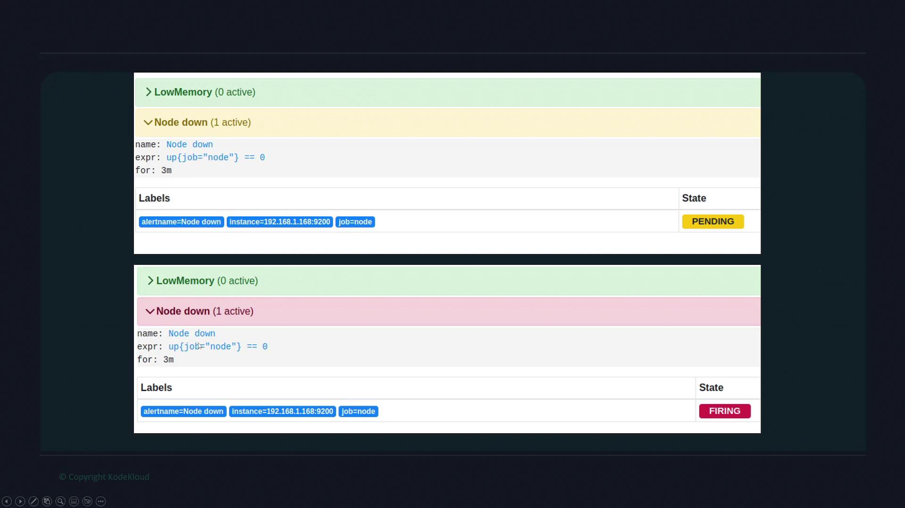

# Introduction
- Prometheus supports the creation of alerting rules (`/etc/prometheus/rules.yaml`) that evaluate using standard PromQL expressions.
- When the expression is met - Prometheus triggers an alert.

> [!NOTE]
> Prometheus is solely responsible for triggering/firing alerts. It does not send notifications such as emails or SMS messages directly. That responsibility is manage by Alertmanager.

- Prometheus sends the alert data to Alertmanager.
- **Alertmanager is a dedicated component in Prometheus that handles notifications by integrating with various communication tools email, Slack, or paging services.**
- A single Alertmanager can manage alerts from multiple Prometheus servers across different environments.

- Alerting rules in Prometheus are configured in a way similar to recording rules and can be combined within the same rule group. - For example, consider the configuration below that includes both a recording rule and an alerting rule:
```yml
groups:
  - name: node
    interval: 15s
    rules:
      - record: node_memory_memFree_percent
        expr: 100 - (100 * node_memory_MemFree_bytes{job="node"} / node_memory_MemTotal_bytes{job="node"})
      - alert: LowMemory
        expr: node_memory_memFree_percent < 20
        for: 3m
```
- In this configuration, the "LowMemory" alert is triggered when the percentage of free memory drops below 20% for at least 3 minutes.

- Another common alert scenario involves monitoring the health of nodes. 
- An alert expression that checks whether a node is down uses the up metric; if this metric equals zero, the target is considered unreachable. 
- To avoid false positives from transient issues like brief network interruptions, the **for** clause is utilized to ensure that the alert is triggered only if the condition persists over a defined period. 
-For example:
```yml
- alert: NodeDown
  expr: up{job="node"} == 0
  for: 3m
```
- With this setting, a node initially enters a pending state if the down condition is detected, and only transitions into the firing state if it remains down for 3 minutes.

> [!NOTE]
> ## Alert States in Prometheus
> Prometheus classifies alerts into three states:
> 1. Inactive: No alert condition is met (expression returns no results).
> 2. Pending: Alert conditions have been detected but have not persisted long enough.
> 3. Firing: Alert conditions have been continuously met for the specified duration, making the alert active.

- Navigate to the Alerts tab on the Prometheus dashboard, will'll see all the current alert statuses. 
    - Inactive alerts are shown in green. 
    - Once an alert condition is detected, the alert appears as pending
    - Then shifts to the firing state if the condition persists beyond the configured duration.


