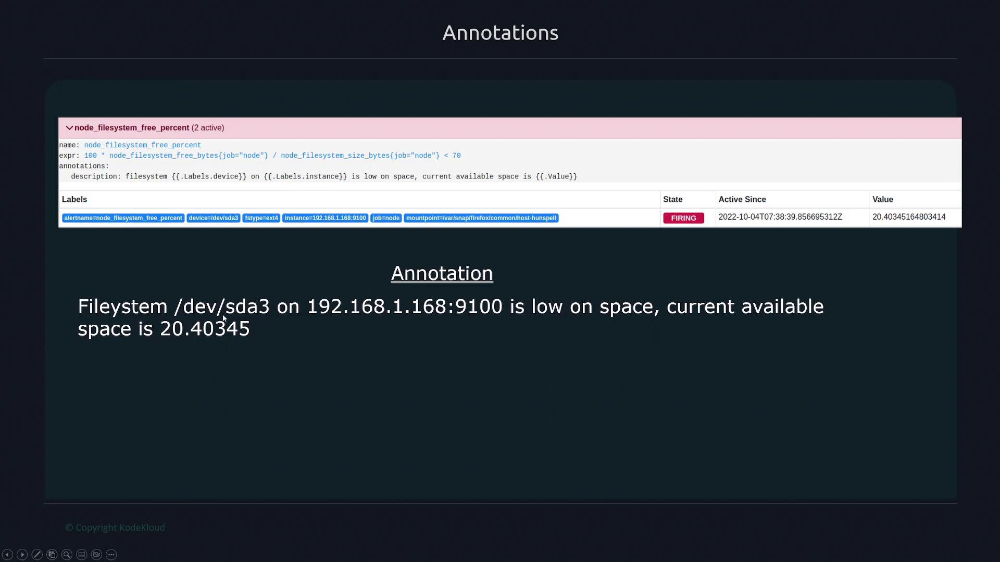

# Labels and Annotations

## Labels: Classifying and Routing Alerts
- Labels are use for classifying and matching alerts in Alertmanger.
- By adding key-value pairs as labels in alert rule configuration, we can filter and route alerts according to specific criteria.
- For example, the following configuration demonstrates two alert rules with different severity levels:
```yml
groups:
  - name: node
    rules:
      - alert: Node down
        expr: up{job="node"} == 0
        labels:
          severity: warning
      - alert: Multiple Nodes down
        expr: avg_without(instance)(up{job="node"}) <= 0.5
        labels:
          severity: critical
```

> [!NOTE]
> Labels are not only used for alert identification but also play a crucial role in establishing routing rules within Alertmanager, ensuring that alerts reach the appropriate teams.

---

## Annotations: Adding Descriptive Context
- Annotations complement labels by providing additional descriptive details about an alert. 
- They do not influence alert matching or routing but instead offer valuable context for understanding the alert's condition.
- Annotations use the Go templating language, enabling dynamic insertion of alert-related information.

- For instance, you can access alert labels within an annotation using the following syntax:
    - Use {{ .labels }} to retrieve all labels.
    - Use {{ .labels.instance }} to get the value of the instance label.
    - Use {{ .value }} to display the metric value at the time of the alert.

- Consider an annotation named "description" that assembles information about the file system, device label, instance name, and current metric value. 
- When triggered, the annotation might state: "file system /dev/sda3 on [target instance] is low on space. Current available space is 20.40345."


