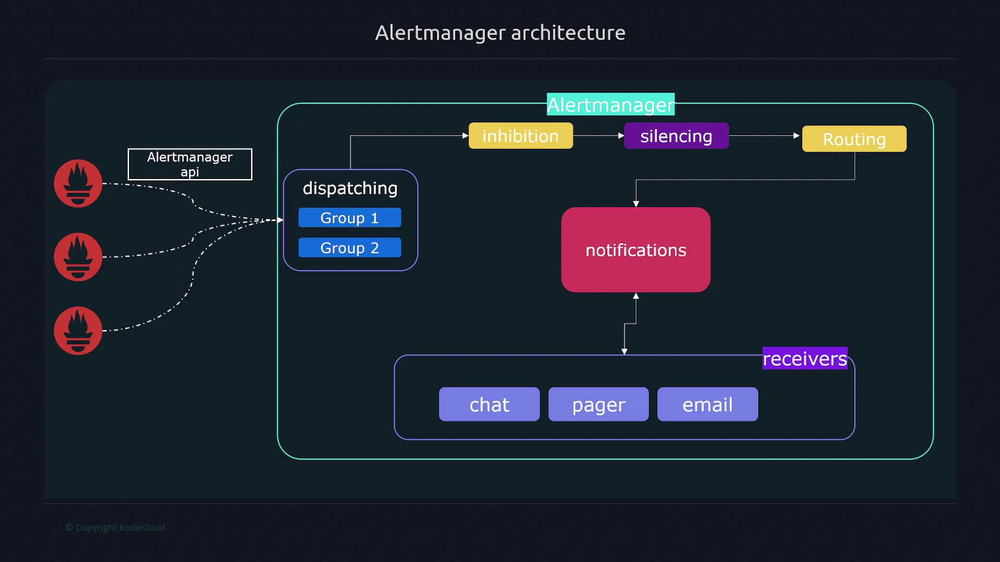
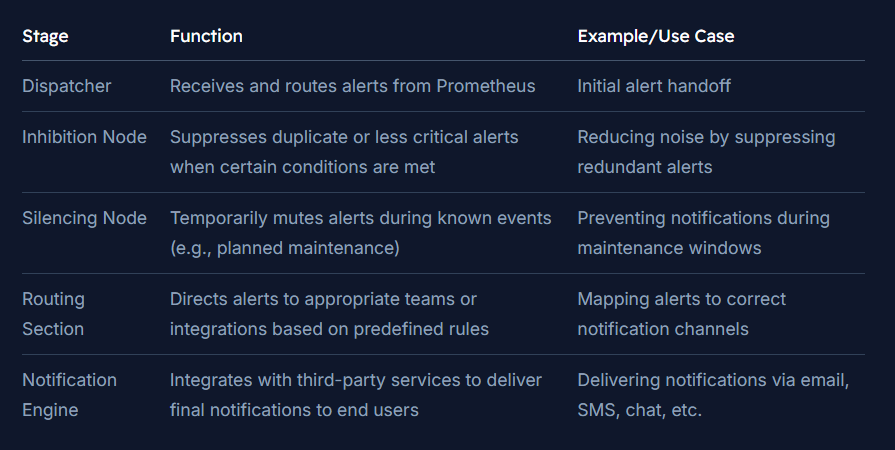

# Alertmanager Architecture
- Alertmanager is a critical component in the Prometheus monitoring ecosystem. 
- It receives alerts from Prometheus, processes them through a series of filter and routing stages, and finally converts them into notifications via various channels such as web pages, webhooks, email, SMS, and more. 
- Additionally, Alertmanager can consolidate alerts from multiple Prometheus servers, providing centralized management through its API.

---

## Alert Processing Flow
- When Prometheus sends alerts to Alertmanager via its API, the processing involves several key stages:
1. **Dispatcher**
    - The alert first enters the dispatcher, which is responsible for routing it to the appropriate processing nodes.
2. **Inhibition Node**: 
    - Next, the alert is passed to the inhibition node. 
    - Here, we can define rules to suppress specific alerts when certain other alerts are active. 
    - For example, if Alert X is firing, we can configure a rule to automatically suppress Alert Y.
3. **Silencing Node**
    - After inhibition, the alert reaches the silencing node. 
    - Silencing rules allow to mute alerts temporarily, which is particularly useful during planned maintenance windows. 
    - This prevents unnecessary notifications when known conditions are being actively managed.
4. **Routing Section**
    - The alert then proceeds to the routing section, where the routing engine evaluates rules to decide which team or integration should receive the notification. 
    - The engine maps alerts to the appropriate destinations based on the alert's characteristics and predefined configurations.
5. **Notification Engine**
    - Finally, the alert is handed over to the notification engine. 
    - This engine integrates with third-party services—such as email providers, pager systems, and chat platforms—to deliver notifications to users effectively.

---

## Summary

