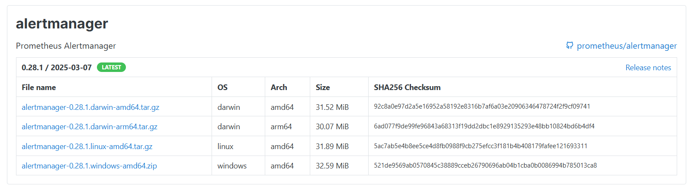

# Installation - Alertmanager
## Step 1: Download and Extract the Alertmanager Binary
1. Go to official Prometheus [downloads page](https://prometheus.io/download/). Copy URL of the [alerrtmanager](https://prometheus.io/download/#alertmanager) for Linux "tar" file.



2. Run the following command to download package. Paste the copied URL after wget in the below command:
```bash
wget https://github.com/prometheus/alertmanager/releases/download/v0.28.1/alertmanager-0.28.1.linux-amd64.tar.gz
```

3. Now go to Alertmanager downloaded location and extract it using `tar` command.
```bash
tar -xvf alertmanager-0.28.1.linux-amd64.tar.gz
```

4. Rename it as per your preference (optional).
```bash
mv alertmanager-0.28.1.linux-amd64.tar.gz alertmanager
```

5. Verify the extracted files by listing the directory contents:
```bash
$ ls -ltr
-rwxr-xr-x 1 user1 user1 31988661 Mar 25  2022 alertmanager
-rw-r--r-- 1 user1 user1      356 Mar 25  2022 alertmanager.yml
-rw-r--r-- 1 user1 user1 25067944 Mar 25  2022 amtool
drwxrwxr-x 2 user1 user1     4096 Aug 23  19:21 data
-rw-r--r-- 1 user1 user1    11357 Mar 25  2022 LICENSE
-rw-r--r-- 1 user1 user1     457 Mar 25  2022 NOTICE
```

---

## Step 2: Configure Alertmanager Files
1. Create the configuration directory, move the configuration file, and update its permissions:
```bash
sudo mkdir /etc/alertmanager
sudo mv alertmanager.yml /etc/alertmanager
sudo chown -R alertmanager:alertmanager /etc/alertmanager
```

2. Create the data directory for runtime data storage and update its ownership:
```bash
sudo mkdir /var/lib/alertmanager
sudo chown -R alertmanager:alertmanager /var/lib/alertmanager
```

---

## Step 3: Configure Systemd for Push Gateway
1. Create a user for the alertmanager.
```bash
useradd --no-create-home --shell /bin/false alertmanager
```
- As we do not need `alertmanager` user to login and have home directory.

2. Copy `alertmanager` binary from the `alertmanager` folder to `/usr/local/bin`.
```bash
cp  alertmanager/alertmanager /usr/local/bin
```

3. Change the ownership to `alertmanager` user.
```bash
chown alertmanager:alertmanager usr/local/bin/alertmanager
```

---

## Step 4: Configure Alertmanager Service Unit file
1. Create the Pushgateway Service File.
```bash
vi /etc/systemd/system/alertmanager.service
```

2. Add the following content to the file.
```bash
[Unit]
Description=Alert Manager
Wants=network-online.target
After=network-online.target

[Service]
Type=simple
User=alertmanager
Group=alertmanager
ExecStart=/usr/local/bin/alertmanager \
  --config.file=/etc/alertmanager/alertmanager.yml \
  --storage.path=/var/lib/alertmanager
Restart=always

[Install]
WantedBy=multi-user.target
```

3. Reload the systemd service.
```bash
systemctl daemon-reload
```

4. Start the alertmanager service.
```bash
systemctl start alertmanager
```

5. Check the alertmanager service status (optional)
```bash
systemctl status alertmanager
```

6. Enable the alertmanager service so that it can get automatically started after boot
```bash
systemctl enable alertmanager
```

7. A typical status output might look like:
```bash
● alertmanager.service - Prometheus Alertmanager
   Loaded: loaded (/etc/systemd/system/alertmanager.service; enabled; vendor preset: enabled)
   Active: active (running) since Fri 2022-10-14 00:19:52 EDT; 5s ago
     Main PID: 536942 (alertmanager)
      Tasks: 5 (limit: 8247)
     Memory: 3.8M
        CPU: 7ms
     CGroup: /system.slice/alertmanager.service
             └─536942 /usr/local/bin/alertmanager
```

---

## Step 4: Verify the Alertmanager Endpoint
- Use the following URL to view the Alertmanager UI.
```bash
http://IP-Address:9093/metrics     # replace IP-Address with the IP of you host (localhost) or VM
```

---

## Step 4: Configure Prometheus to Route Alerts to Alertmanager
- To forward alerts from Prometheus to Alertmanager, update Prometheus's configuration file (`/etc/prometheus/prometheus.yaml`).
- Locate the alerting section and add the following configuration under static_configs:
```yml
global:
  scrape_interval: 15s
  evaluation_interval: 15s

alerting:
  alertmanagers:
    - static_configs:
        - targets:
            - localhost:9093
            - alertmanager1:9093

rule_files:
  - "rules.yml"

scrape_configs:
  # Add scrape configuration details here.
```
- Alertmanager runs on port `9093`.