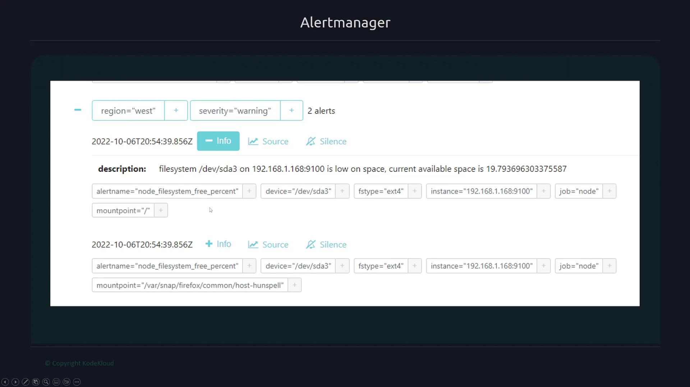

# Receivers and Notifiers
- Receivers aggergates/group alerts into actionable notifications.
- Each receiver integrates one or more notifiers, which dispatch these notifications to various platforms, such as Slack or email.
- In the example below, we define a receiver called `infra-pager` and associate it with a routing rule:
```yml
route:
  receiver: infra-pager
receivers:
- name: infra-pager
  slack_configs:
  - api_url: https://hooks.slack.com/services/XXXXXXXXX
    channel: "#pages"
  email_configs:
  - to: "receiver_mail_id@gmail.com"
    from: "mail_id@gmail.com"
    smarthost: smtp.gmail.com:587
    auth_username: "mail_id@gmail.com"
    auth_identity: "mail_id@gmail.com"
    auth_password: "password"
```
- In this configuration, both Slack and email notifiers are set up with their respective parameters. 
- For additional configuration options, please refer to the notifier’s documentation.

---

# Global Configuration
- To reduce redundancy, we can define common parameters globally.
- For example, if several receivers require the same VictorOps API key, we can set it in a global block:
```yml
global:
  victorops_api_key: XXX
receivers:
- name: infra-pager
  victorops_configs:
  - routing_key: some-route
```

- Similarly, if multiple teams share most email settings except for the recipient address, use the global configuration to avoid duplication. 
- In the following example, the common SMTP settings are defined globally, while team-specific receivers only specify their unique email address:
```yml
global:
  smtp_smarthost: 'smtp.gmail.com:587'
  smtp_from: 'alertmanager@kodekloud.com'
  smtp_auth_username: xxxx
  smtp_auth_identity: xxxx
  smtp_auth_password: xxxx
receivers:
- name: 'infra'
  email_configs:
  - to: 'infra@kodekloud.com'
- name: 'frontend'
  email_configs:
  - to: 'frontend@kodekloud.com'
- name: 'k8s'
  email_configs:
  - to: 'k8s@kodekloud.com'
```

---

# Customizing Notification Messages with Go Templates
Notifiers enable customization of notification messages using the Go templating system.
    - **Group Labels**: All labels shared within a notification group.
    - **Common Labels**: Labels common to all alerts in the group.
    - **Annotations**: Additional descriptive data provided by alerts.
    - **External URL**: A link to the AlertManager instance for further investigation.
    - **Status**: Indicates whether alerts are "firing" (active) or "resolved" (cleared).
    - **Receiver Name**: Identifies which receiver is handling the alerts.
    - **Details for Individual Alerts**: Includes labels, annotations, and timestamps such as start and end times.

## Example: Slack Notification Template
- The following example demonstrates a Slack notification template where the title dynamically incorporates severity and region group labels:
```yml
route:
  receiver: 'slack'
receivers:
- name: slack
  slack_configs:
  - api_url: https://hooks.slack.com/xxx
    channel: '#alerts'
    title: '{{ .GroupLabels.severity }} alerts in region {{ .GroupLabels.region }}'
    text: '{{ .Alerts | len }} alerts:'
```
- This template creates a dynamic title (for example, "critical alerts in region west") by referencing `{{ .GroupLabels.severity }}` and `{{ .GroupLabels.region }}`. 
- The text element displays the total number of alerts by using the len function on the .Alerts list.

- For more detailed notifications, we can expand the template to multiple lines. 
- If the template string is too long for one line, use the `>` operator to create a multi-line string and iterate over alerts to include specific annotations:
```yml
route:
  receiver: 'slack'
receivers:
- name: slack
  slack_configs:
  - api_url: https://hooks.slack.com/xxx
    channel: '#alerts'
    title: '{{ .GroupLabels.severity }} alerts in region {{ .GroupLabels.region }}'
    text: >
      {{ .Alerts | len }} alerts:
      {{ range .Alerts }}
      {{ .Annotations.description }}{{ "\n" }}
      {{ end }}
```
- This expanded configuration first displays the number of alerts and then iterates through each alert to print its description from the annotations.

---

# Alert Grouping in AlertManager
- AlertManager groups alerts based on specified labels. 
- In the example below, alerts are grouped by both region and severity:
```yml
route:
  group_by: ['severity', 'region']
```
- This configuration might result in separate notifications for the West region with a warning severity and the East region with a critical severity.


