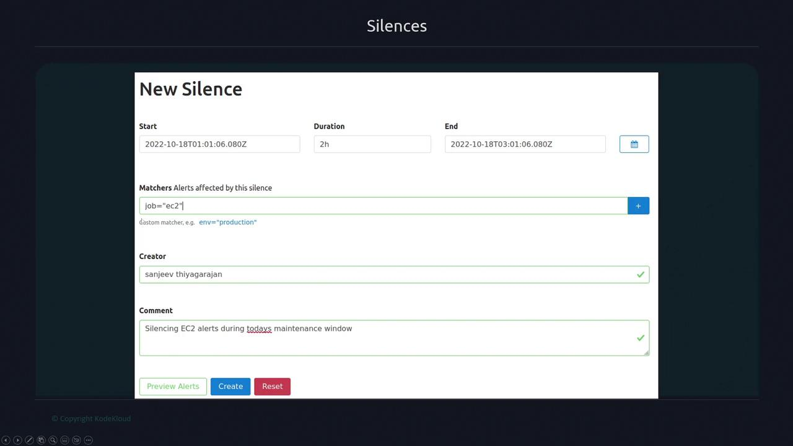
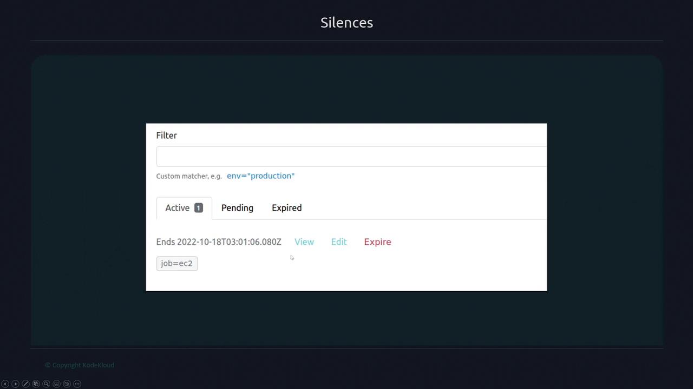

# Silences
- Alerts can now be silenced, preventing notification generation during specific periods. 
- This feature is particularly useful during maintenance windows when planned changes might trigger expected issues.

- To silence alerts, navigate to the "New Silence" tab. 
- In this area, we can configure a silence by setting the start time, duration, and a list of matchers. 
- Matchers allow to specify a set of labels - any alerts that align with these labels will be silenced.

- Switch to the "Silences" tab to view all active, pending, and expired silences. 
- This interface displays the expiration time and offers options to view, edit, or expire a silence.

