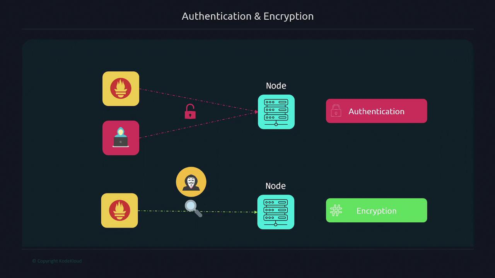
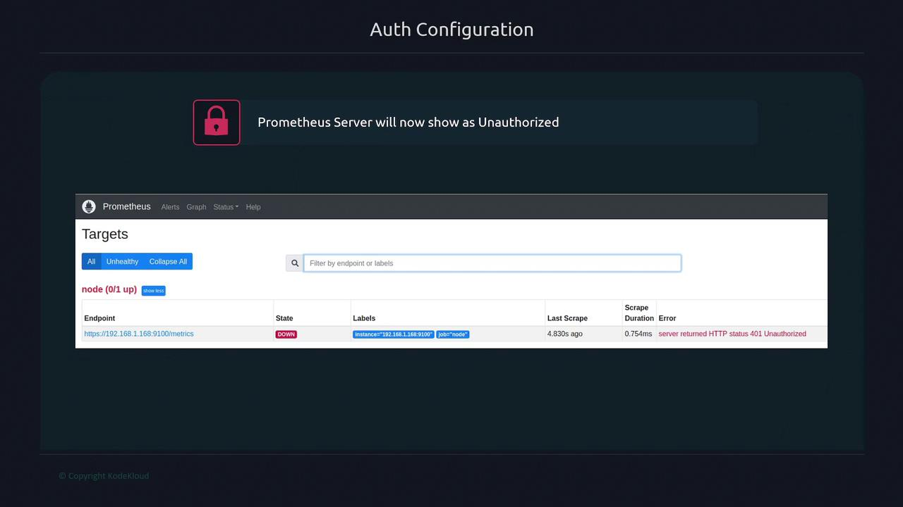

# Authentication - Encryption
Authentication-Encyption helps ensure that only authorized users or systems can access the metrics.

Below are two primary challenges:
- Without authentication, any entity with access to your target can scrape the metrics.
- Without encryption, data traveling between Prometheus and the target is sent as plain text and is vulnerable to interception.

Encrypting traffic with TLS ensures that even if someone sniffs the network, they will only see encrypted data. 



Below are the steps to set up authentication and encryption.

---

# 1. Generating Certificates
To enable secure TLS communications, first generate a certificate. 
The example below uses OpenSSL to create a self-signed certificate valid for one year. (You can also use a certificate from providers like Let's Encrypt, VeriSign, or another Certificate Authority based on your organization's requirements.)

```bash
sudo openssl req -new -newkey rsa:2048 -days 365 -nodes -x509 \
  -keyout node_exporter.key -out node_exporter.crt \
  -subj "/C=US/ST=California/L=Oakland/O=MyOrg/CN=localhost" \
  -addext "subjectAltName = DNS:localhost"
```

After running the command, you should see the following files:
- node_exporter.crt (the certificate)
- node_exporter.key (the private key)

You can verify the files by listing the directory contents:
```bash
ls -l
-rw-r--r-- 1 user2 user2 11357 Dec  5  2021 LICENSE
-rwxr-xr-x 1 user2 user2 18228926 Dec  5  2021 node_exporter
-rw-r--r-- 1 root  root  1326 Sep  5 18:04 node_exporter.crt
-rw------- 1 root  root  1700 Sep  5 18:04 node_exporter.key
```

---

# 2. Configuring Node Exporter with TLS
Next, create a `config.yml` file for the Node Exporter that includes TLS settings. (similar to Prometheus's configuration)
```bash
vi config.yml
```

```yaml
# config.yml - node exporters configuration
tls_server_config:
  cert_file: node_exporter.crt
  key_file: node_exporter.key
```

Then, start the Node Exporter process:
```bash
./node_exporter --web.config=config.yml
```

You should see output confirming that TLS is enabled:
```bash
ts=2022-09-05T22:26:53.965Z caller=node_exporter.go:115 level=info collector=zfs
ts=2022-09-05T22:26:53.966Z caller=node_exporter.go:199 level=info msg="Listening on" address=:9100
ts=2022-09-05T22:26:53.966Z caller=tls_config.go:228 level=info msg="TLS is enabled." http2=true
```

> [!NOTE]
> Ensure the config.yml file is placed in the same directory as your certificate and key files.

---

# 3. Organizing Configuration Files
It is a best practice to store configuration files within the /etc directory. Follow these steps:
- Create a folder for Node Exporter configurations under /etc.
- Move the certificate and key files to this folder.
- Copy the configuration file to the same folder.
- Update folder permissions to allow the Node Exporter user to access these files.

```bash
sudo mkdir /etc/node_exporter
mv node_exporter.* /etc/node_exporter
sudo cp config.yml /etc/node_exporter
sudo chown -R node_exporter:node_exporter /etc/node_exporter
```

---

# 4. Updating the Node Exporter Service
To use the new configuration file, update the Node Exporter systemd service:
1. Open and edit the service file:
```bash
vi /etc/systemd/system/node_exporter.service
```

2. Example of a systemd configuration for Node Exporter:
```ini
[Unit]
Description=Node Exporter
Wants=network-online.target
After=network-online.target

[Service]
User=node_exporter
Group=node_exporter
Type=simple
ExecStart=/usr/local/bin/node_exporter --web.config=/etc/node_exporter/config.yml

[Install]
WantedBy=multi-user.target
```

3. Reload the systemd daemon and restart Node Exporter:
```bash
systemctl daemon-reload
systemctl restart node_exporter
```

When using self-signed certificates, testing with tools like curl will require an insecure flag, as seen below:
```bash
curl https://localhost:9100/metrics
curl: (60) SSL certificate problem: self-signed certificate
More details here: https://curl.se/docs/sslcerts.html
```

For testing, bypass verification using the -k flag:
```bash
curl -k https://localhost:9100/metrics
# HELP promhttp_metric_handler_requests_total Total number of scrapes by HTTP status code.
# TYPE promhttp_metric_handler_requests_total counter
promhttp_metric_handler_requests_total{code="200"} 10217
promhttp_metric_handler_requests_total{code="500"} 0
promhttp_metric_handler_requests_total{code="503"} 0
```

---

# 5. Configuring TLS for Prometheus
With Node Exporter now requiring HTTPS, update the Prometheus configuration accordingly:
1. Copy the Node Exporter certificate to the Prometheus server using SCP:
```bash
scp username:password@node:/etc/node_exporter/node_exporter.crt /etc/prometheus
sudo chown prometheus:prometheus /etc/prometheus/node_exporter.crt
```

2. Open the Prometheus configuration file for editing:
```bash
vi /etc/prometheus/prometheus.yml
```

3. Modify the configuration with these changes:
- Change the scheme to https.
- Under tls_config, provide the CA file location.
- Set insecure_skip_verify to true (since you are using self-signed certificates).
```yaml
scrape_configs:
  - job_name: "node"
    scheme: https
    tls_config:
      ca_file: /etc/prometheus/node_exporter.crt
      insecure_skip_verify: true
    static_configs:
      - targets: ["192.168.1.168:9100"]
```

4. Restart Prometheus:
```bash
sudo systemctl restart prometheus
```

---

# 6. Setting Up Basic Authentication
Adding basic authentication further secures your setup. Follow these steps:
1. Generate a hashed password using Apache's htpasswd tool. Install apache2-utils if needed:
```bash
$ sudo apt install apache2-utils
$ htpasswd -nBC 12 "" | tr -d ':\n'
New password:
Re-type new password:
$2y$12$gfAopKV008KKO63rJe0Z9efGRx30qJEZ9vcC8IxBP9.cXkurguc6
```
This hashed password will be used in the Node Exporter configuration.

2. Update your Node Exporter configuration file (/etc/node_exporter/config.yml) with the basic authentication block. Replace the example hash with the one you generated:
```yaml
tls_server_config:
  cert_file: node_exporter.crt
  key_file: node_exporter.key
basic_auth_users:
  prometheus: $2y$12$dCqkk9uah20wF
```

3. Restart Node Exporter:
```bash
sudo systemctl restart node_exporter
```

At this point, if you check the Prometheus targets page, you might see one target down because of an HTTP 401 Unauthorized error. This happens because Prometheus is not yet configured to authenticate with the target.



To resolve this issue, update the Prometheus configuration to include basic authentication:
1. Edit the Prometheus configuration file:
```bash
vi /etc/prometheus/prometheus.yml
```

2. Add the basic_auth configuration with the username and plain text password (the same one used to generate the hash):
```yaml
scrape_configs:
  - job_name: "node"
    scheme: https
    basic_auth:
      username: prometheus
      password: password
    tls_config:
      ca_file: /etc/prometheus/node_exporter.crt
      insecure_skip_verify: true
    static_configs:
      - targets: ["192.168.1.168:9100"]
```

3. Restart Prometheus:
```bash
sudo systemctl restart prometheus
```

After these changes, the Prometheus targets page should show the target as active (up), confirming that both TLS and basic authentication are properly configured.