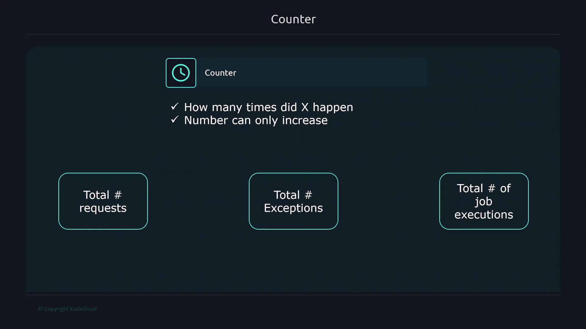
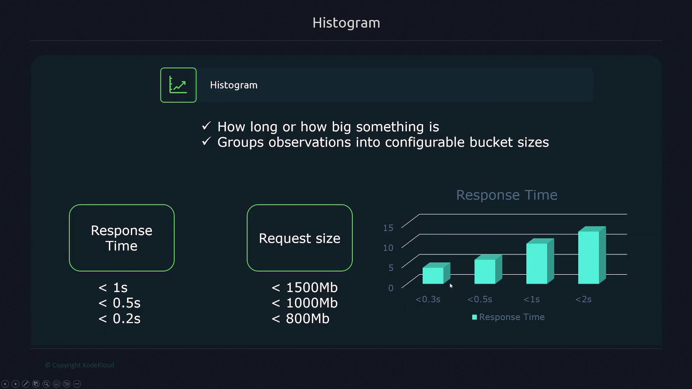
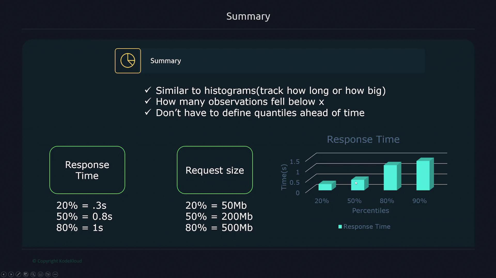

# Metrics
A Prometheus metric consists of three main components: a **name**, **labels** and a **value**.

- A metric name is a descriptive identifier that defines what the metric represents.
- Labels are key-value pairs that add context to the metric, and a metric can have multiple labels. Labels make it possible to include detailed information about a metric.
- A metric value represents the observed measurement at a specific point in time.

Example: 
- Consider a **metric named** "node_cpu_seconds_total" from the Node Exporter.
- This metrics captures (**metrics value**) the total number of seconds the CPU has spent in different modes.
- **Labels** associated with this metric defines further details such as - which CPU core is being referenced and the state of the CPU  (such as idle, iowait, irq, etc.).
- In the following example, the metric shows that CPU 0 spent approximately 258,000 seconds in idle mode. In multi-CPU systems, each CPU is identified with its unique label (e.g., "cpu=0", "cpu=1", etc.):
```ini
node_cpu_seconds_total{cpu="0",mode="idle"} 258277.86
node_cpu_seconds_total{cpu="1",mode="idle"} 427262.54
node_cpu_seconds_total{cpu="2",mode="idle"} 283288.12
node_cpu_seconds_total{cpu="3",mode="idle"} 258202.33
```

**When Prometheus scrapes a target, it collects metrics accompanied by a Unix timestamp.**

Every metric stored in Prometheus is timestamped to record the exact moment the measurement was taken. This timestamp is vital for constructing time series data in Prometheus.

> [!NOTE]
> The Unix timestamp (e.g., 1668215300) represents the number of seconds since January 1, 1970, UTC (the Unix epoch). We can convert this timestamp into a human-readable format using any Unix timestamp converter.

---

# Time Series 
A time series in Prometheus is a **sequence of timestamped values that share the same metric name and identical labels.**
Any unique combination of a metric name with its labels represents a distinct time series.

Consider the following example featuring metrics from two different systems:

```ini
node_filesystem_files{device="sda2", instance="server1"}
node_filesystem_files{device="sda3", instance="server1"}
node_filesystem_files{device="sda2", instance="server2"}
node_filesystem_files{device="sda3", instance="server2"}


node_cpu_seconds_total{cpu="0", instance="server1"}
node_cpu_seconds_total{cpu="1", instance="server1"}
node_cpu_seconds_total{cpu="0", instance="server2"}
node_cpu_seconds_total{cpu="1", instance="server2"}
```

Even though there are only **two metrics** (node_filesystem_files and node_cpu_seconds_total), the **four distinct label** combinations for each result in **eight separate time series**. 

---

# Metric Attributes
Beyond the name, labels and value every Prometheus metric includes two additional attributes: 
- **Help**: Describes the metric 
- **Type**: Represents the metric nature

Example:
```ini
# HELP node_disk_discard_time_seconds_total This is the total number of seconds spent by all discards.
# TYPE node_disk_discard_time_seconds_total counter
node_disk_discard_time_seconds_total{device="sda"} 0
node_disk_discard_time_seconds_total{device="sr0"} 0
```

## Metrics Type:
Prometheus supports four primary metric types:
1. **Counter**:
A counter metric **counts the number of occurrences of an event and can only increase**.
It is ideal for monitoring total requests, errors, or other cumulative counts.



2. **Gauge**:
A gauge metric **represents a value that fluctuates over time**, such as current CPU utilization, memory usage, or the number of concurrent requests.

3. **Histogram**:
A histogram metric **groups observations into configurable buckets, which is useful for tracking duration or sizes**.

Example: When monitoring application response times, you might set up buckets at 0.2 seconds, 0.5 seconds, and 1 second. The count in each bucket is cumulative, meaning that the bucket for 0.5 seconds includes all values from the 0.2-second bucket as well.



4. **Summary**:
A summary metric **works similarly to a histogram by tracking durations or sizes but additionally provides quantile information** (e.g., 20%, 50%, 80% percentiles) without the need to predefine buckets. 

Example: A summary might indicate that 20% of requests finish in under 0.3 seconds, 50% under 0.8 seconds, and 80% under one second.



---

# Metric Naming and Labels
## Metric Naming 
Metric names should clearly indicate the feature or component they represent.

### Metric Naming Rules
- Can contain ASCII letters, numbers, underscores, and colons.
- Must match the regex [a-zA-Z_:][a-zA-Z0-9_:]*
- Colons are reserved only for recording rules.

## Labels
Labels are key-value pairs that add context to the metric. 
- It allows to split up a metric by a specified criteria.
- It provides additional categorization for metrics.
- Metric can have more than one label.
- Label names can include ASCII letters, numbers, and underscores and must match a defined regex pattern. 

Example:
- A practical application of labels can be seen in API request tracking. 
- Instead of creating separate metrics for each endpoint (e.g., "requests_auth_total" and "requests_user_total"), a single metric "requests_total" can be used with a label called "path" to distinguish between endpoints. 
- When metrics need further differentiation (such as by HTTP methods), an additional label (e.g., "method") is introduced:

```ini
requests_total{path="/auth", method="get"}
requests_total{path="/auth", method="post"}
requests_total{path="/auth", method="patch"}
requests_total{path="/auth", method="delete"}
```

> [!NOTE]
> - Internally, the metric name (such as "node_cpu_seconds_total") is stored as a label called `__name__`. 
> - The labels with names enclosed in double underscores (like `__name__`) are reserved for internal use by Prometheus.

> [!NOTE]
> - By default, each metric is automatically assigned two labels: **instance** and **job**. 
> - The "instance" label corresponds to the target defined in the configuration, and the "job" label aligns with the job name provided in "prometheus.yaml" file.
> ```yaml
> - job_name: "node"
> scheme: https
> basic_auth:
>   username: prometheus
>   password: password
> static_configs:
> - targets:
>   - "192.168.1.168:9100"
> ```