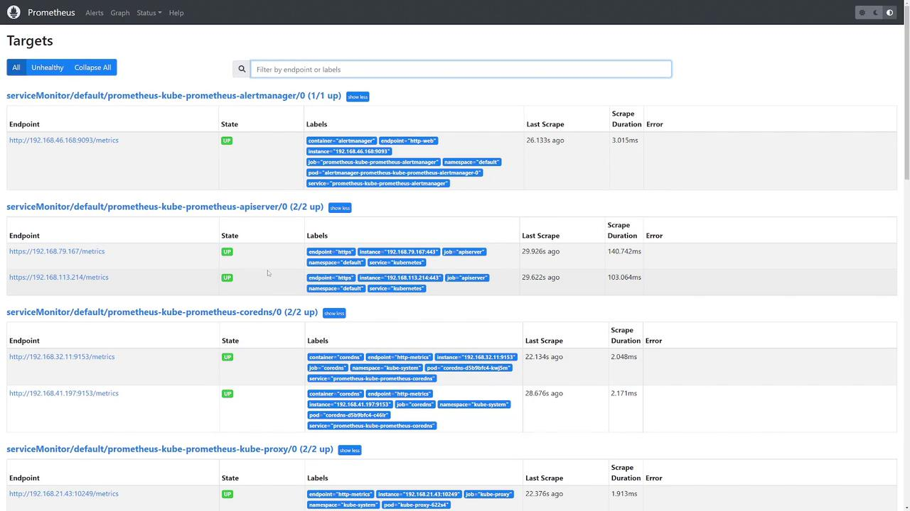

# Prometheus Configuration
- Kubernetes provides native service discovery, allowing Prometheus to automatically detect and scrape metrics from various endpoints across the cluster.
- Below is an overview of the four available service discovery options:
    - **Node Service Discovery**: Identifies all nodes within a Kubernetes cluster and captures associated metadata labels.
    - **Service Discovery**: Discovers all services along with their designated ports.
    - **Pod Service Discovery**: Detects all pods running in the cluster.
    - **HTTP Endpoint Service Discovery**: The most flexible method; it uses the HTTP endpoint information (IP address and port) of any Kubernetes resource (pod, service, node, etc.) to discover targets, applying additional label-based filtering.

- Check the Prometheus UI, we should see that all configured targets (AlertManager, kubelet instances, the API server, CoreDNS, etc.) are marked as "UP", confirming that they are actively being monitored.

