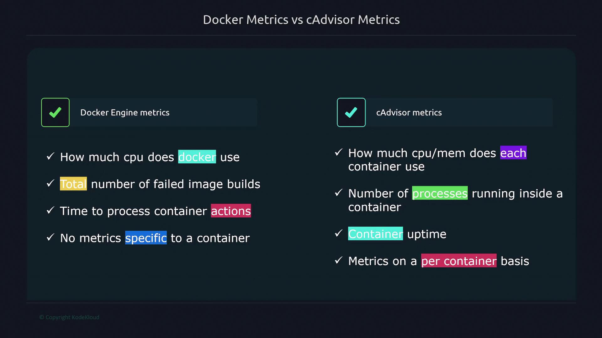

# Monitoring Containers
Prometheus can collect these metrics from two main sources:
- Docker Engine metrics
- Container-specific metrics with cAdvisor

## Enabling Docker Engine Metrics
Follow below steps on Docker host to enable Docker Engine metrics:
1. Create a file named `daemon.json` in the `/etc/docker` directory.
2. Configure the Docker daemon to expose the metrics endpoint. In this file, specify the metrics adapter, set the IP address and port, and enable experimental features.
3. Restart Docker to apply these changes.
4. Verify the configuration by curling the metrics endpoint.

Below is an example configuration and the corresponding commands:

```bash
$ vi /etc/docker/daemon.json
$ sudo systemctl restart docker
$ curl localhost:9323/metrics
```

```json
{
  "metrics-addr": "127.0.0.1:9323",
  "experimental": true
}
```

After restarting Docker, the metrics will be available on the configured port.

Next, update your Prometheus configuration by adding a new scrape job for Docker metrics:

```yml
scrape_configs:
  - job_name: "docker"
    static_configs:
      - targets: ["12.1.13.4:9323"]
```

Replace "12.1.13.4" with the actual IP address of your Docker host.

---

## Enabling cAdvisor for Container Metrics
To obtain detailed, container-specific metrics, deploy cAdvisor using Docker Compose. Follow these steps:
1. Create a Docker Compose file.
2. Define a service for cAdvisor, ensuring it has the necessary privileges and mounts to access system metrics.
3. Launch cAdvisor on your Docker host.

Below is an example Docker Compose configuration for deploying cAdvisor:

```yml
version: '3.4'
services:
  cadvisor:
    image: gcr.io/cadvisor/cadvisor
    container_name: cadvisor
    privileged: true
    devices:
      - "/dev/kmsg:/dev/kmsg"
    volumes:
      - /:/rootfs:ro
      - /var/run:/var/run:ro
      - /sys:/sys:ro
      - /var/lib/docker:/var/lib/docker:ro
      - /dev/disk:/dev/disk:ro
    ports:
      - 8000:8000
```

Start the cAdvisor container with Docker Compose:
```bash
docker-compose up
```

Once cAdvisor is running, verify its metrics by executing:
```bash
curl localhost:8000/metrics
```

Update your Prometheus configuration to add a scrape job for cAdvisor metrics:
```yml
scrape_configs:
  - job_name: "cAdvisor"
    static_configs:
      - targets: ["12.1.13.4:8000"]
```

Replace "12.1.13.4" with your Docker host's actual IP address. 

---

# Comparing Docker Engine and cAdvisor Metrics
Docker Engine metrics provide insights into the performance of the entire Docker engine. These metrics include CPU usage, the total number of failed image builds, and the processing time for container actions. However, they do not offer container-specific details.

In contrast, cAdvisor delivers a granular view of individual container performance, covering:
- CPU and memory usage per container
- The number of processes running within a container
- Container uptime

Below is a summary comparison of Docker Engine and cAdvisor metrics:


Feature	Docker Engine Metrics	cAdvisor Metrics
Scope	Overall engine performance	Detailed container-specific performance
CPU & Memory Utilization	General engine metrics	Per-container usage details
Process Tracking	Not available	Detailed process count per container
Use Case	Monitoring Docker daemon health	In-depth analysis of container behavior

The following diagram further illustrates the distinctions between Docker Engine and cAdvisor in terms of CPU usage, container-specific metrics, and process tracking:



> [!Tip]
> For a comprehensive monitoring solution, use Docker metrics for overall engine health and cAdvisor metrics for detailed container performance insights.
